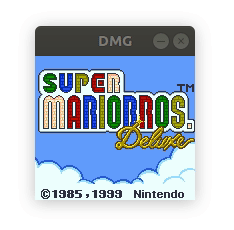

# `YAGBE`
**Y**et **A**nother **G**ame **B**oy **E**mulator.



# Scope

The scope of this repo is not to be a fully feature standalone emulator, but rather to provide a set of primitives
(component emulation, serialization, etc) that may be used to build emulators and tools. The `dmg-frontend` module
contains two emulator as reference, one native (backed by SDL), and another that runs on the web (using WebAssembly).

## Project Structure

- `dmg-lib/ ................... Emulator crate.`
- `dmg-boot/ .................. Internally used to manage the boot ROMs.`
- `dmg-peripherals`
    * `camera ................. GameBoy Camera emulation.`
- `dmg-driver/`
    * `sdl2/ .................. SDL2-backed video and audio backend.`
    * `wasm/ .................. WebAssembly & JS backend.`
    * `gl/ .................... OpenGL Texture-backed video backend.`
- `dmg-frontend/`
    * `native/ ................ Example native emulator frontend.`
    * `web/ ................... Example web-based GameBoy Camera emulation.`
- `dmg-tools`
    * `src/bin/check_rom.rs ... Standalone CLI tools.`

# Boot ROMs

The boot ROM is a small program that runs at the beginning of the emulation to initialize the state of the console.

The `dmg-lib` crate can be built with a feature flag (`--features boot`) to include the boot ROM from both GB and CGB.
In GB emulation mode, the boot doesn't do much, but in CGB it can be used to [add color to non-CGB games].

[add color to non-CGB games]: https://www.reddit.com/r/nintendo/comments/43hzdo/til_the_color_palette_of_the_game_boy_color_can/

If you own both boot ROMs, you must define them in two environment variables, and enable the `boot` feature flag in the
dmg-lib dependency. If you don't already own them, they can easily be found online.

```bash
export DMG_BOOT_GB_ROM="<path_to_gb_boot_rom>"
export DMG_BOOT_CGB_ROM="<path_to_cgb_boot_rom>"
```

Additionally, if you want to support some of the peripherals listed below, you must also provide their own ROM if they
require one.

Then, in your Cargo.toml

```toml
# Cargo.toml

[dependencies.dmg-lib]
features = ["boot"]
```

> **NOTE:** The build process performs some shallow validations on the provided ROMS, but there is not guarantee that, if
> the provided ROMS are not correct, the crate will not buid.

## Features

| Feature        | Support | Notes
| -------------- | :-----: | ---
| Cycle accuracy | ❌      | Out of scope. Some obscure games and demoscene demos that require very precise timing might fail as a result.
| Classic GB     | ✔️       | Works on most games I tested (see compatibility table) except the ones that require super precise timing.
| Color GB (CGB) | ✔️       | Known glitches on some games (see compatibility table).
| Super GB (SGB) | ❌      | Outside of current scope, but maybe in the near future.
| Sound          |         |
| Serial         |         |
| Peripherals    | ✔️       | See Peripherals section below.


## Peripherals

| Peripheral      | Requirements                | Notes 
| ---             | ---                         | ---
| Game Boy Camera | `DMG_PERIPHERAL_CAMERA_ROM` | You must provide your own ROM in the env variable.

## Tests

### CPU instruction tests

| Test                       | Pass
| -------------------------- | :---:
| `01-special.gb`            | ✔️
| `02-interrupts.gb`         | ✔️
| `03-op sp,hl.gb`           | ✔️
| `04-op r,imm.gb`           | ✔️
| `05-op rp.gb`              | ✔️
| `06-ld r,r.gb`             | ✔️
| `07-jr,jp,call,ret,rst.gb` | ✔️
| `08-misc instrs.gb`        | ✔️
| `09-op r,r.gb`             | ✔️
| `10-bit ops.gb`            | ✔️
| `11-op a,(hl).gb`          | ✔️

### CPU timming tests

| Test | Pass
| ---- | :---:

## Tested Games

| Rom | Works | Comments
| --- | ----- | ---

## Resources

- https://github.com/AntonioND/giibiiadvance/blob/master/docs/TCAGBD.pdf
- https://gekkio.fi/files/gb-docs/gbctr.pdf
- https://github.com/gbdev/awesome-gbdev
