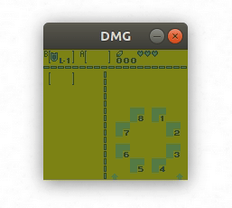
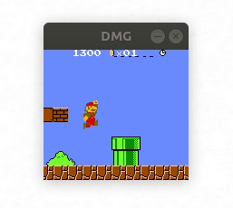
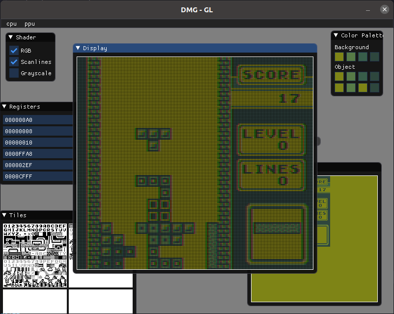
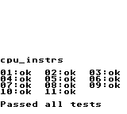
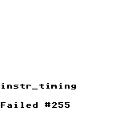

# `rust-gameboy`

**Game Boy** and **Game Boy Color** emulation in Rust.

Still a bit *buggy*, but works with most games I've tried, albeit with some minor graphical glitched showing up on some of them.




## Features

| Feature | Support | Notes
| --- | :-----: | ---
| Cycle accuracy | ❌ | Out of scope (I might change my mind later).
| Classic GB | ✔️ | Works with most games, except the ones that require cycle accuracy.
| Color (CGB) | ✔️ | Still buggy. Working on it.
| Sound | | Still buggy. Working on it.
| Link cable | | In scope but not implemented yet.

## Building

Building any of the modules requires the following environment variables to be defined:

```bash
# these must be defined when you cargo build your crate
export DMG_BOOT_GB_ROM="<path_to_gb_boot_rom>"
export DMG_BOOT_CGB_ROM="<path_to_cgb_boot_rom>"
```

## Debugging

The GL-based frontend has some debugging functionality (only graphics for now though).



## Tests

### CPU instruction tests

```bash
cargo test cpu_instrs
```



### CPU timing tests

```bash
cargo test instr_timing
```



## Tested Games

| Rom | Works | Comments
| --- | ----- | ---

## License

`TODO`

## Resources

- http://problemkaputt.de/pandocs.htm
- https://gbdev.gg8.se/wiki/
- https://github.com/AntonioND/giibiiadvance/blob/master/docs/TCAGBD.pdf
- https://gekkio.fi/files/gb-docs/gbctr.pdf
- https://github.com/gbdev/awesome-gbdev
