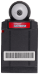

# `dmg-peripheral`

Peripherals are cartridges that implement some special functionality.

## Supported

| Name | Picture | Requirements | Notes 
| --- | :---: | --- | ---
| Camera |  | `DMG_PERIPHERAL_CAMERA_ROM` | Environment variable must be defined at build time

## Implement new peripherals

Implementing new peripherals is straightforward.

The only requirements is that the type is marked with the `Cartridge` and implement the `Mapped` trait.

```Rust
use dmg_lib::{cartridge::Cartridge, map::Mapped};

struct MyPeripheral {
    // ...
}

impl Cartridge for MyPeripheral {}

impl Mapped for MyPeripheral { 
    fn read(&self, addr: u16) -> u8 {
        // peripherals are mapped to two regions:
        // ref: http://problemkaputt.de/pandocs.htm#memorymap
        match addr {
            0x0000..=0x7fff => self.read_rom(addr),
            0xa000..=0xbfff => self.read_ram(addr),
            _ => unreachable(),
        }
    }

    fn write(&mut self, addr: u16, data: u8) {
        // ...
    }
}
```

